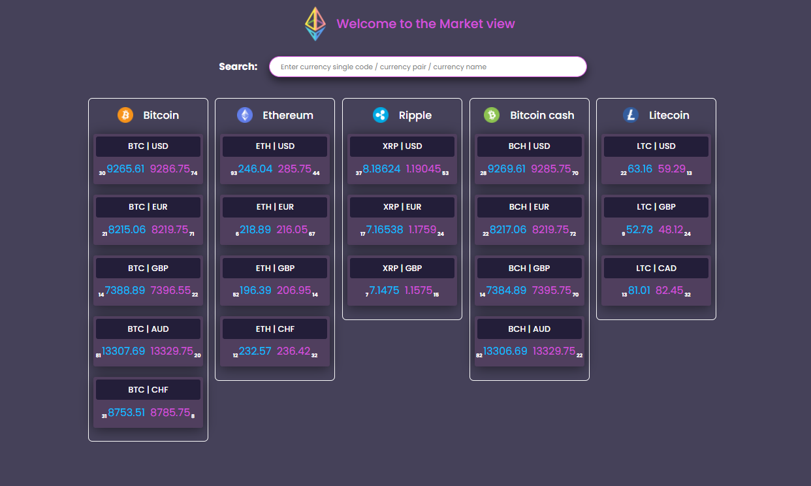
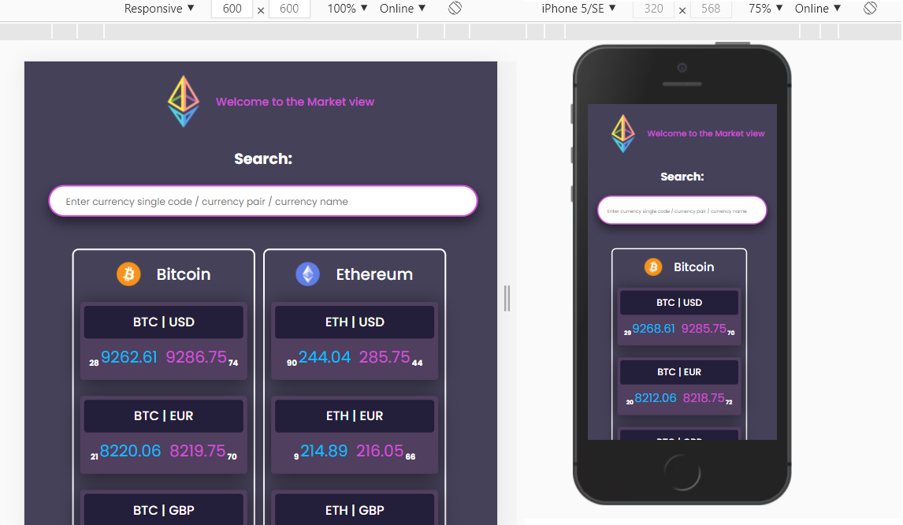
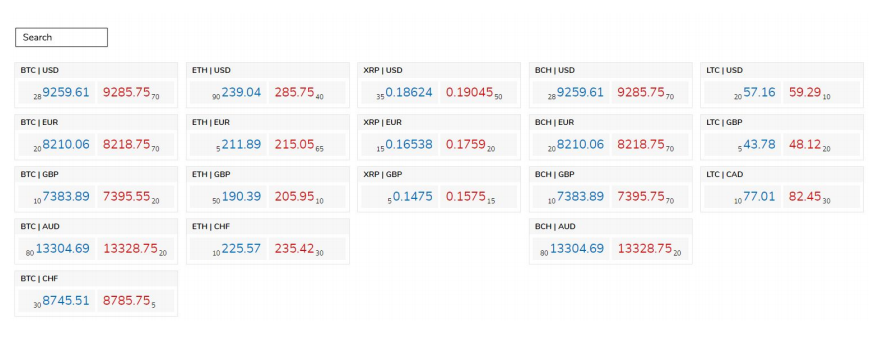

# Market-View

### Project demo:
#### https://youthful-austin-aa6b0a.netlify.app/

---

### You can run and test this project:
1. clone repository
### `git clone https://github.com/Ainika-Kos/ha_28_stone.git`
2. when project is cloned and opened in the editor, open new terminal and type command
### `npm install`
3. when node-modules folder is ready, type command
### `npm run start`
4. you can open this project in the browser
### `http://localhost:3000`
5. open new terminal and type
### `npm run test`

---

### Main information about this project:
1. React TypeScript single page application 
2. Created according to the technical and business requirements
3. Responsive and user-friendly design

---

### Libraries used in this project:
1. [axios](https://github.com/axios/axios) - for fetching data
2. [flexboxgrid](http://flexboxgrid.com/) - for creating responsive design 
3. [sass](https://github.com/sass/node-sass) - for using variables and nested rools in styles
4. [enzyme](https://enzymejs.github.io/enzyme/) - for testing this project

---

## Requirements

### Market View (Front End)

As we mainly work with trading markets, the technical task is to create a Whiteboard of trading
instruments called Market View.

### Technical requirements:

1. You can use Angular, React or Vue.js.
2. You can use npm/yarn package manager to manage dependencies.
3. Optionally, you can use any CSS framework (Tailwind CSS, Material UI, Bootstrap, etc.)
4. Having unit tests using Jasmine, Jest or any other testing framework, as an advantage.
5. Application can support Google Chrome browser.
6. Deliver the code either in Github or as a zip file.
7. Make sure to document your project in a simple README.md file so it would be easier for us
to set up, run and test your application.

### Business requirements:

<ol>
<li>Market view wireframe:</li>

<li>The client application should be a single page application with 2 components:</li>
<ul>
<li>The market view which should show a list of instrument tiles grouped by left
currency. Each instrument tile should contain:</li>
<ul>
<li>Currency pair</li>
<li>Bid side info (price and amount) on the left side of instrument</li>
<li>Offer side info (price and amount) on the right side of instrument</li>
</ul>
<li>Search input field on the top of the screen. It should filter instruments by currency
pair (full or partial match).</li>
</ul>
<li>There should be real-time updates logic making prices/amounts to change on the fly. The
price/amount of any instrument (in the Market View) should be updated once a second with a
different value.</li>
<li>Instruments will be provided in an instruments.json file and should be fetched using HTTP
request.
</li>
</ol>

---
